# Little Ben's Big Treats

My website is a digital e-commerce site with a theme around baking and sweet treats. The site features a range of products baked and created by a team of professional bakers with the intention of baking and delivering them to the end user. A user is able to purchase any product from the site as well as view baking recipes. The core of the site is to encourage purchasing of the products but also to get the user interested in baking as a hobby.

[Link to Deployed site](https://lbbt.herokuapp.com)

## UX 

### CRUD

Product: Create, Read, Update, Delete
User/Profile: Create, Read, Update
Order: Create, Read
Review: Create, Read

### Strategy Plane

Little Ben's Big Treats is designed with all age groups and a large customer base in general. It will be designed with a friendly and easy to understand layout so that any user will be able to access it with ease.

#### Ideal User

- Someone who wants to purhcase a dessert/snack for an event
- Someone who wants to find new recipes to research or purchase
- Someone who wants to try a product before attempting to bake a recipe
- Someone who wants to check on their order status

### User Stories

1. Django Epic
    - User Story - Django Setup: As a Developer, I want to set up Django and install any libraries that may be needed to start development.
        - Acceptance Criteria: After using pip to install Django and creating a project, Django will notify me that it has installed successfully after attempting the runserver command
    - User Story - Secret Keys: As a Developer, I want to create hidden variables and secret keys stored in an env file so that I do not leak any important credentials.
        - Acceptance Criteria: All keys necessary to development will be stored within a variable rather than displaying the key in any project files
    - User Story - Heroku Deployment: As a Developer, I want to Deploy my project to Heroku so that the website can be accessed with all of the libraries and requirements available.
        - Accetpance Criteria: The site will be accessible via a live Heroku link. All features/libraries from the development version will carry over to the live Heroku version
2. User Accounts
    - User Story - User Registration: As a user, I want to register for the website, so that I can manage and place orders from the store with saved info.
        - Acceptance Criteria: User is able to access the allauth user registration view. All the user information is saved and they can now sign in/out of the site
    - User Story - Account Log in/Out: As a User, I would like to be able to get in and out of my account, so that I can keep my account secure and access my own details
        - Acceptance Criteria: User is able to securely Log Into account using provided credentials during sign up. User is able to securely log out of account and any private information is protected once done so.
    - User Story - Edit Account: As a user I want to edit my site account, so that I can update the credentials used for logging in/out and managing my email address.
        - Acceptance Criteria: User Is able to update their own account information via all auth templates
    - User Story - Delete Account: As a User, I would like to be able to delete my account, so that I have full control over the information that is stored about me
        - Acceptance Criteria: A user will be given a button that when pressed will remove their account from the database. If this is done correctly then their user data and any models attached to it will be removed from the database.
3. Site Purpose
    - User Story - About us: As a user, I want to read a general guide/history about the site/company to make an informed purchase decision or gain brand loyalty.
        - Acceptance Criteria: Have an accessible About Us page that provides the user with a brief but ample explanation to the site history.
4. Products
    - User Story - Product Search: As a User, I would like to be able to search for products, so that I can find the product I am looking for easily
        - Acceptance Criteria: Users will have easy access to search functionality from anywhere on the website. When a query is entered the product listings will display all products that match their query.
    - User Story - Product Listing Page: As a User, I would like to be able to view summary details of a list of products so that I can quickly narrow down the products that I am interested in
        - Acceptance Criteria: When a user searches for a product, then the products are displayed in a listed summary format. All products matching the query, category, or all products are visible

5. Shopping Bag
    - User Story - View bag: As a User, I would like to be able to view the contents of my shopping cart, so that I can confirm the details prior to proceeding to purchase
        - Acceptance Criteria: User is able to access their bag from any location on the site. The view is able to render all products that have been saved to the bag accurate to the user input
6. Checkout
7. Product Review
    - User Story - Review Product: As a user, I would like to review a product so that I can help inform other users about a product and give my personal feedback
        - Acceptance Criteria: The form is able to be submitted and contains user review information including some text and a score out of 5. The product will then be connected to the product model to be accessed by the product details view.
    - User Story - Read Product Reviews: As a User, I want to read product reviews so that I can make an informed purchasing decision before placing an order for a product.
        - Acceptance Criteria: Any reviews are loaded by the product details view that match the product id. Existing Reviews are rendered into the product details template to be viewed by users
    - User Story - Respond to User Reviews: As an admin, I want to respond to user reviews, so that I can engage with users more directly in regard to product feedback and critique.
        - Acceptance Criteria: A comment will appear on an existing user review highlighted as an admin response.
8. Digital Marketing
    - User Story - SEO: As a Site Owner, I would like to enhance the sites Search Engine Optimisation, so that ultimately the site has the ability to perform well in search results and can be found with ease
        - Acceptance Criteria: Ensure that meta keywords are present across website pages to boost SEO. Ensure the necessary files are in place so spiders have a guide to the site and boost SEO score
9. Blog
    - User Story - Make Blog Post: As an admin, I would like to be able to add a blog post to the site, so that we can easily add posts, recipes and trends to the site
        - Acceptance Criteria: When a superuser is logged into their account, then they will have the ability to create a new blog post
    - User Story - View Blog Post: As a User, I would like to be able to read blog posts, so that I can keep up to date on the company and find out all the latest baking trends and recipes
        - Acceptance Criteria: Users can navigate to the blog post page, where they are presented with all the blog posts that are available
10. User Profiile

### Skeleton Plane

#### Wireframes

Home page: The home page will welcome the users to the site and give a clear description as to the purpose of the site. The graphics will be familiar to gamers to make sure they immedietly feel welcome.

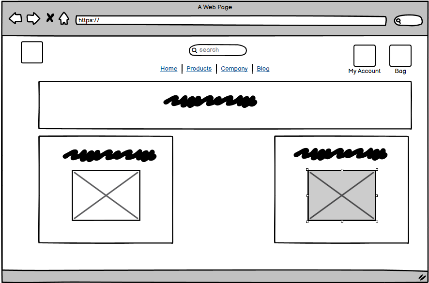

Product List Page:

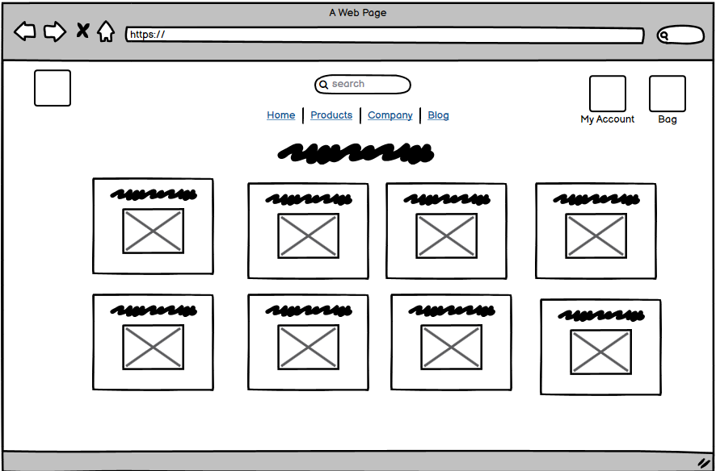

Product Detail Page

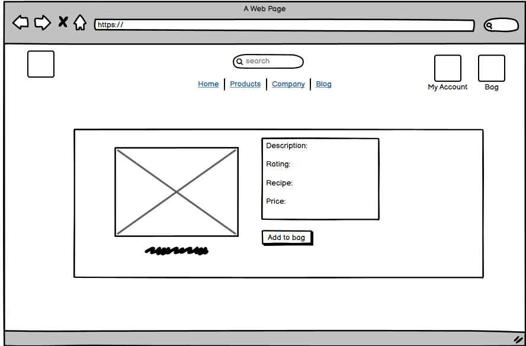

Bag:

Checkout:

Account Page:

Blog: 

### Surface

- Font

The main site headings used the DynaPuff font as it maintained a childlike/icing sort of texture that I think fit the theme of the site very well

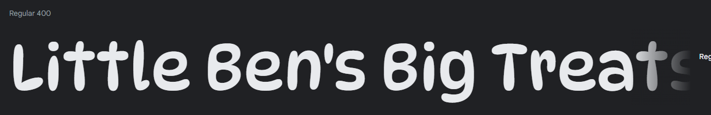

The body of the site used the Poppins font as it was easy to read at a range of screen sizes and allows the site content to be accesible to a range of users

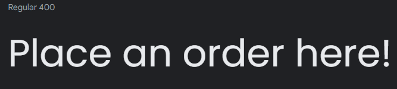

## Database Schema

I knew going into the project that custom models were going to be required when building the site. The intention was always to use Allauth to handle all the user authentication. This meant that the User model would be very involved across multiple sections of my website. Things such as an order, checkout and bag would all need to relate to the user who saved it and ensuring that the whole process would relate back to the user model, including the profile. The user and profile go hand in hand and would ensure that information could be saved to the user profile to be used across the rest of the site such as order history and delivery information.

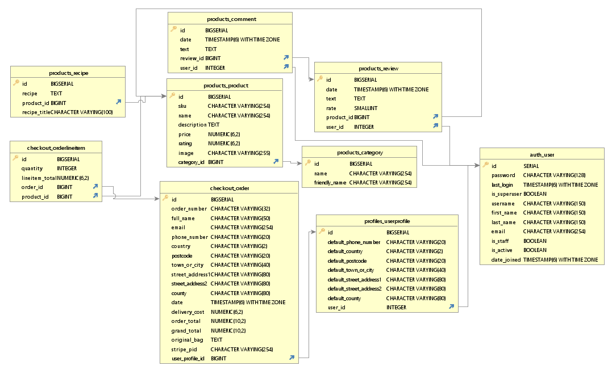

## Features

Home Page:

The Home Page welcomes the user into the site with a clear heading and description as to what the site does. From here the user can easily find some of the key features and offers of the site. All of the site headers are made a focal point and the user can easily begin to start navigating the site.

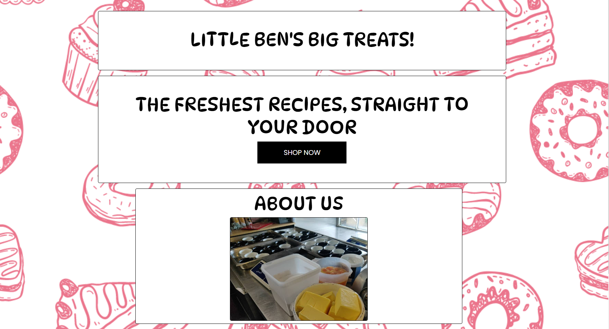

Nav Bar: 

The nav bar has a simple design that makes it easy for the user to find available links and the site logo. Clicking on the site logo will also bring the user to the home page from any other page on the site. The links are capitalized and easy to locate. The search bar is also ingrained into the nav bar with a toggle button which makes it easy for the user to make a product search from any location on the site. A direct link to the user account page and the users bag is also highlighted at the end. This allows all of the main site features to be easily accessed by the user.

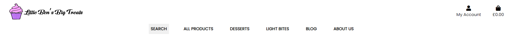

USER STORY: Search Products:

    - As a User, I would like to be able to search for products, so that I can find the product I am looking for easily

On mobile the nav bar will squish down into a "burger bun" icon which when pressed will present the user with the nav bar options

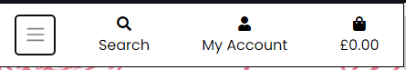

Product Listing Page:

When a user searches for a product or uses one of the navigation links to view a category, a listing of products is rendered. A helpful card containing some key information regarding to the product is easily shown to the user. From here a super user is also able to easily make quick changes to a product with an edit and a delete button. By clicking onto the product picture a user is able to view details about a particular product

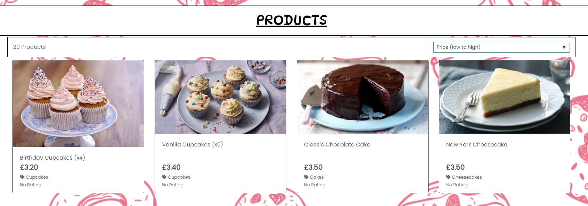

User Story - Product Listing Page:

    - As a User, I would like to be able to view summary details of a list of products so that I can quickly narrow down the products that I am interested in

Product Page:

The product page takes the product id of the selected product from either the product listings page or an external link and renders information onto a template for the user to read. From here a user can access some detailed information relating to the product including a full size photo, description and even a basic recipe similar to the product. From here a user is also able to quickly add a product to the bag where it can then be brought into the checkout for purchase. A user is able to read reviews relating to the product as well as see the total score calculated on the average of review scores.

Product Recipe:

On all products that have a recipe, a recipe button is made viewable that when clicked will open a popup window containing a product recipe. It intended to not be a 1 to 1 recipe resembling the product the user will purchase and is instead an effort to try encourage more people to bake and to use the site as a recipe index as well to find more food to bake.

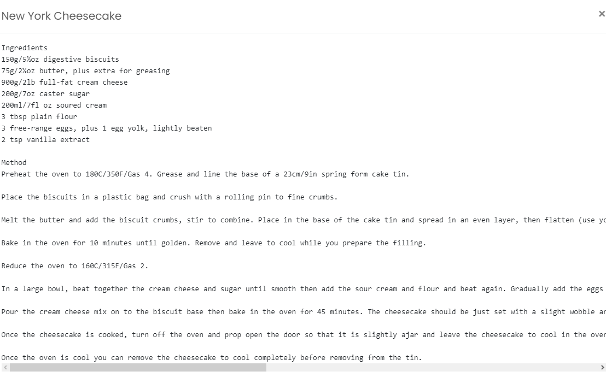

Add to Bag:

On every productt page an add to bag button is available. When this is pressed the product is saved to the current users bag and a message will display to inform the user that the process has been completed. 

USER STORY: Add to Bag:

    - As a User, I would like to be able to add products that I want to buy to my shopping cart so that I can proceed to purchase them

Product Review:

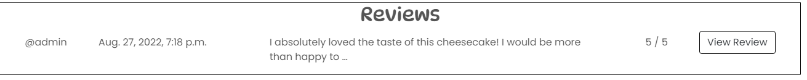

The Review section under a product details page will display the user reviews for the sellected product. It will display a limited preview to make sure the page is not taken up by lengthy reviews and instead opts the user to click a "View Review" button which will show just the specified review in full detail. Here a user can also select a score out of 5 which is then added onto the product details page to calculate the product average.

USER STORY: Review Product

    - As a user, I would like to review a product so that I can help inform other users about a product and give my personal feedback

About Us:

The About us page gives the user a friendly and informative introduction to the site and gives a general purpose. A friendly greeting helps to enchance the business to customer angle and attempts to bridge the gap between these roles. The site features a direct link to the about us from the nav bar and the home screen to bring users onto the page as soon as possible.

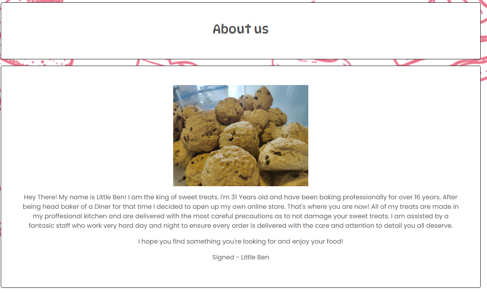

USER STORY: About us

    - As a user, I want to read a general guide/history about the site/company to make an informed purchase decision or gain brand loyalty.

Bag:

The user is able to add any product listing on the site straight to a bag. The bag page contains a preview of all the items currently in it with a photo. A rundown of all the pricing and how far away the price is from free delivery. This ensures the customer can always know that the option is available to them if they want to save more money. From a business point of view it also makes sense to push the customer to purchase more product by hitting a certain threshold.

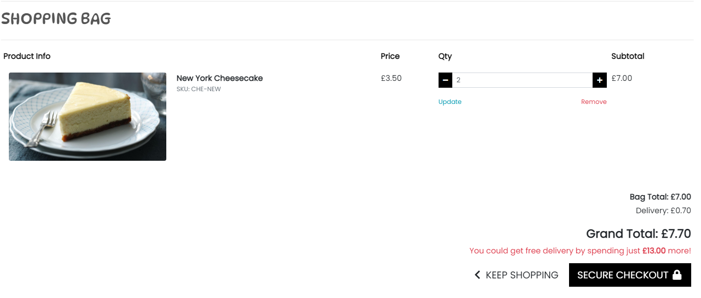

USER STORY: Add to Bag

    - As a User, I would like to be able to add products that I want to buy to my shopping cart so that I can proceed to purchase them

USER STORY: View Bag

    - As a User, I would like to be able to view the contents of my shopping cart, so that I can confirm the details prior to proceeding to purchase

Checkout:

In the checkout the user is given one final review of all the products that they intend on purchasing with a rundown of the prices of the individual prices and the grand total. A delivery total is also calculated if the total does not meet the threshold. Here the customer can also fill out the checkout form to pass their details to be saved for the order. The user can also check to save these delivery details to their profile by checking the tick box. When the user fills out the form and enters their payment details stripe will process the payment and redner a success page.

Order History:

Either after a direct purchase from the checkout or from accessing the history from the user profile. The user can access an order details page which will display all the details of the order that was placed. This includes the delivery information as well as the order price. The same order details screen will be emailed to the user at the email provided on sign up if applicable.

User Profile:

Digital Marketing: 

## Future Features

### Blog

## Testing

A mix of Manual and Automated testing was used in this project to make sure every element of the site worked in the intended manner.

A full detailed breakdown of the testing procedures and methodology can be found in the testing.md file

## Technologies

- HTML
    - HTML was used as the base language for the templates created for the site.

- Bootstrap
    - Bootstrap was used for general layout and spacing requirements for the site.

- Django
    - Django was used as the main python framework in the development of this project

- Python
    - asgiref==3.5.2
    - cloudinary==1.29.0
    - coverage==6.4.4
    - dj-database-url==0.5.0
    - dj3-cloudinary-storage==0.0.6
    - Django==3.2.15
    - django-allauth==0.41.0
    - django-cloudinary-storage==0.3.0
    - django-countries==7.2.1
    - django-crispy-forms==1.14.0
    - gunicorn==20.1.0
    - oauthlib==3.2.0
    - Pillow==9.2.0
    - psycopg2==2.9.3
    - python3-openid==3.2.0
    - pytz==2022.1
    - requests-oauthlib==1.3.1
    - stripe==4.1.0
    - sqlparse==0.4.2

- Heroku
    - Was used as the cloud based platform to deploy the site on

- Heroku PostgreSQL
    - Was used as the live database.

- Git
    - Was utilised for version control and transferring files between the code editor and the repository

- Github
    - Was used for storing and updating the project files

## Bugs

While trying to ensure the live version of the site was fully functional the email smtp would return a 500 internal server error whenever certain pages would be interacted with. This would include logging in/out, registering and placing orders. To try and fix this I would alter the sendgrid settings and even try generating a new API key. However after not having any luck I opted to try the google smtp which ended up working out. 

## Deployment

The site was deployed via Heroku, here is the [Link to Deployed site](https://lbbt.herokuapp.com)

### Project Deployment

The steps to deploy this project were simple and are as followed: 
- Sign up / Log in to Heroku
- From the main Heroku Dashboard page select 'New' and then 'Create New App'
- Give the project a name and select a suitable region, then select create app. The name for the app must be unique.
- This will create the app within Heroku and bring you to the deploy tab. From the submenu at the top, navigate to the resources tab.
- Add the database to the app, in the add-ons section search for 'Heroku Postgres', select the package that appears and add 'Heroku Postgres' as the database
- Navigate to the setting tab, within the config vars section copy the DATABASE_URL to the clipboard for use in the Django configuration.
- Within the django app repository create a new file called env.py - within this file import the os library and set the environment variable for the DATABASE_URL pasting in the address copied from Heroku. - - The line should appear as os.environ["DATABASE_URL"]= "Paste the link in here"
- Add a secret key to the app using os.environ["SECRET_KEY"] = "your secret key goes here"
- Add the secret key just created to the Heroku Config Vars as SECRET_KEY for the KEY value and the secret key value you created as the VALUE
- In the settings.py file within the django app, import Path from pathlib, import os and import dj_database_url
- insert the line if os.path.isfile("env.py"): import env
- remove the insecure secret key that django has in the settings file by default and replace it with SECRET_KEY = os.environ.get('SECRET_KEY')
- replace the databases section with DATABASES = { 'default': dj_database_url.parse(os.environ.get("DATABASE_URL"))} ensure the correct indentation for python is used.
- In the terminal migrate the models over to the new database connection
- Navigate in a browser to cloudinary, log in, or create an account and log in.
- From the dashboard - copy the CLOUDINARY_URL to the clipboard
- in the env.py file created earlier - add os.environ["CLOUDINARY_URL"] = "paste in the Url copied to the clipboard here"
- In Heroku, add the CLOUDINARY_URL and value copied to the clipboard to the config vars
- Also add the KEY - DISABLE_COLLECTSTATIC with the Value - 1 to the config vars
- this key value pair must be removed prior to final deployment
- Add the cloudinary libraries to the list of installed apps, the order they are inserted is important, 'cloudinary_storage' goes above 'django.contrib.staitcfiles' and 'cloudinary' goes below it.
- in the Settings.py file - add the STATIC files settings - the url, storage path, directory path, root path, media url and default file storage path.
- Link the file to the templates directory in Heroku TEMPLATES_DIR = os.path.join(BASE_DIR, 'templates')
- Change the templates directory to TEMPLATES_DIR - 'DIRS': [TEMPLATES_DIR]
- Add Heroku to the ALLOWED_HOSTS list the format will be the app name given in Heroku when creating the app followed by .herokuapp.com
- In your code editor, create three new top level folders, media, static, templates
- Create a new file on the top level directory - Procfile
- Within the Procfile add the code - web: guincorn PROJECT_NAME.wsgi
- In the terminal, add the changed files, commit and push to GitHub
- In Heroku, navigate to the deployment tab and deploy the branch manually - watch the build logs for any errors.
- Heroku will now build the app for you. Once it has completed the build process you will see a 'Your App Was Successfully Deployed' message and a link to the app to visit the live site.

### Clone Repo

Creating a clone enables you to make a copy of the repository at that point in time - this lets you run a copy of the project locally: This can be done by:

- Navigating to https://github.com/BritishBambi/LBBT-pp5
- Clicking on the arrow on the green code button at the top of the list of files
- Selecting the clone by https option and copy the URL it provides to the clipboard
- Navigate to your code editor of choice and within the terminal change the directory to the location you want to clone the repository to.
- Type 'git clone' and paste the https link you copied from github
- Press enter and git will clone the repository to your local machine

### Fork Repo

By forking the GitHub Repository you can make a copy of the original repository to view or change without it effecting the original repository This can be done by logging into GitHub or creating an account.  Locate the repository at https://github.com/BritishBambi/LBBT-pp5 . At the top of the repository, on the right side of the page, select "Fork" from the buttons available. A copy of the repository should now be created in your own repository.

## Acknowledgements

- My Waypoint project was used as guidance for site elements and the review feature was directly ported over
- Thanks to My mentor Daisy McGirr for believing in me through the project and for answering the questions I had throughout.
- The Code Institute e-commerce project was referenced as a walkthrough during production for important steps and as a general guide.

## Credits

- Credit to [Julie Ucha](https://www.julieucha.com) for designing the logo and icon for the site.
- All recipes and product listing have been taken from (BBC Food)[https://www.bbc.co.uk/food] and all assets belong to them.