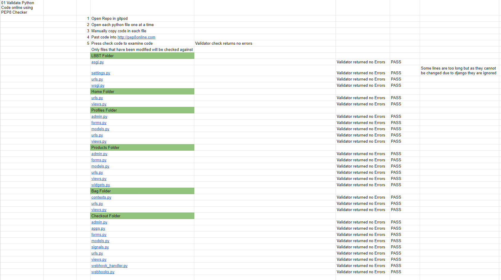

# Testing and Verifying 

## Test Case 01 - Validate Python Code online using PEP8 Checker

The Python code was checked using the pep8 validator available at pep8online.com. The code from each file was copied in its entirity and checked for errors. All the files returned no serious issues and the error codes that were given related to line length which could not be altered.

* Screenshots of the validator reports are here:
    * LBBT Folder
        * [asgi.py file](/assets/screenshots/testing/lbbt-asgi.PNG) 
        * [settings.py file](/assets/screenshots/testing/lbbt-settings.PNG) 
        * [urls.py file](/assets/screenshots/testing/lbbt-urls.PNG) 
        * [wsgi.py file](/assets/screenshots/testing/lbbt-wsgi.PNG)
    * Home Folder
        * [urls.py file](/assets/screenshots/testing/home-urls.PNG)
        * [vies.py file](/assets/screenshots/testing/home-views.PNG)
    * Profiles Folder 
        * [admin.py file](/assets/screenshots/testing/profiles-admin.PNG)
        * [forms.py file](/assets/screenshots/testing/profiles-forms.PNG) 
        * [models.py file](/assets/screenshots/testing/profiles-models.PNG) 
        * [urls.py file](/assets/screenshots/testing/profiles-urls.PNG) 
        * [views.py file](/assets/screenshots/testing/profiles-views.PNG)
    * Products Folder 
        * [admin.py file](/assets/screenshots/testing/products-admin.PNG) 
        * [forms.py file](/assets/screenshots/testing/products-forms.PNG)
        * [models.py file](/assets/screenshots/testing/products-models.PNG)
        * [urls.py file](/assets/screenshots/testing/products-urls.PNG))
        * [views.py file](/assets/screenshots/testing/products-views.PNG)
        * [widgets.py file](/assets/screenshots/testing/products-widgets.PNG)
    * Bag Folder
        * [contexts.py file](/assets/screenshots/testing/bag-contexts.PNG)
        * [urls.py file](/assets/screenshots/testing/bag-urls.PNG)
        * [views.py file](/assets/screenshots/testing/bag-views.PNG)
    * Checkout Folder
        * [admin.py file](/assets/screenshots/testing/checkout-admin.PNG)
        * [apps.py](/assets/screenshots/testing/checkout-apps.PNG)
        * [forms.py file](/assets/screenshots/testing/checkout-forms.PNG) 
        * [models.py file](/assets/screenshots/testing/checkout-models.PNG)
        * [signals.py fle](/assets/screenshots/testing/checkout-signals.PNG)
        * [urls.py file](assets/screenshots/testing/checkout-urls.PNG) 
        * [views.py file](/assets/screenshots/testing/checkout-views.PNG)
        * [webhook_handler file](/assets/screenshots/testing/checkout-webhook_handler.PNG)
        * [webhooks file](/assets/screenshots/testing/checkout-webhooks.PNG)

## Test Case 02 - Validate Javascript Online using JSHint

The JavaScript code was checked using the jshint.com validator available at jshint.com. No errors were detected within the files I created.

* Screenshots of the validator reports are here:
    * Javascript
        * [Bag](/assets/screenshots/testing/js-bag.PNG) 
        * [Countryfield](/assets/screenshots/testing/js-countryfield.PNG) 
        * [Products](/assets/screenshots/testing/js-products.PNG) 
        * [Quantity Script](/assets/screenshots/testing/js-quantity-input.PNG)
        * [script.js](/assets/screenshots/testing/js-script.PNG)
        * [Stripe](/assets/screenshots/testing/js-stripe.PNG)

## Test Case 03 - Validate CSS online using W3C CSS Validation

TWhen validating by url it discovers a total of 711 warnings relating to the Mailchimp newsletter imported css and the bootstrap code. When validating by direct input the validator also reports a warning about the imported style sheet - or the google font import, the warning only states that it does not check the imported style sheet in direct input mode and can be ignored.

## Test Case 04 - Manual HTML Testing - Unregistered User

